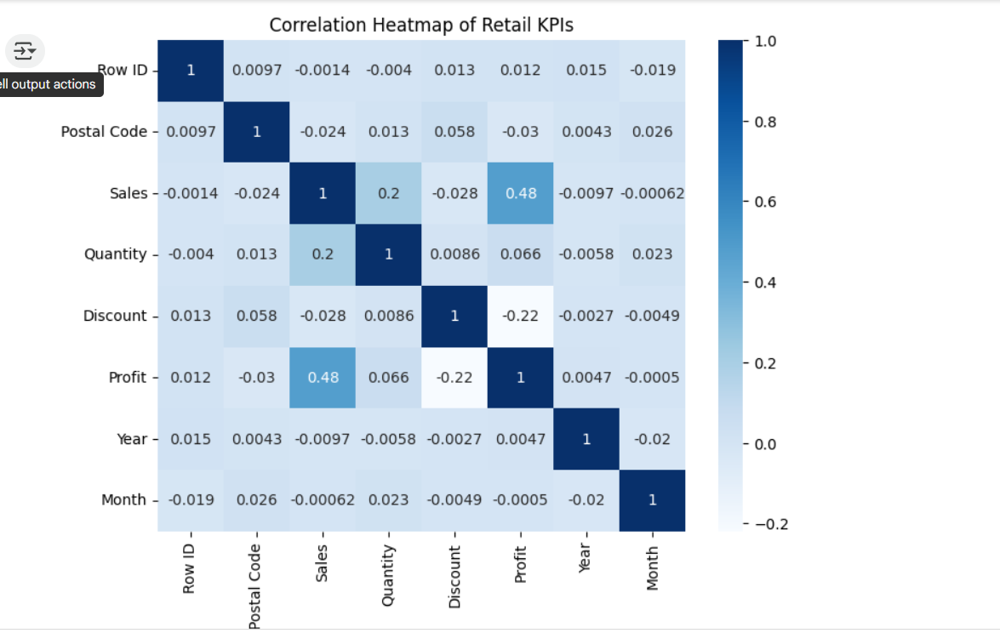

# Retail-Data-Cleaning-Correlation-Analysis---Python

## Overview

This project showcases a full workflow for cleaning, transforming, and analyzing real-world retail sales data (vaibhav.csv) using Python (pandas, matplotlib, seaborn) in Google Colab. The analysis identifies missing data, performs type corrections, engineering, and investigates key business performance drivers through correlation and visualization.

## Project Steps

- *Data Loading:* Imported CSV using pandas with encoding handling.
- *Data Cleaning:* Filled missing values, parsed dates, standardized text.
- *Feature Engineering:* Extracted "Year" and "Month" from "Order Date" for time-based analysis.
- *Exploratory Analysis:* Ran descriptive statistics and checked for outliers.
- *Correlation Analysis:* Calculated and visualized relationships between Sales, Quantity, Discount, etc.
- *Visualization:* Provided a correlation heatmap and boxplot for reporting.
- *Export:* Saved the cleaned data for further analytics or dashboarding.

## Files in this Repo

- Sample - Superstore.csv – Raw sample data (retail sales)
- vaibhav_cleaned.csv – Output: cleaned data
- Pyproject.ipynb – The main annotated Colab/Jupyter notebook
- Heatmap.png – (Optional) Correlation heatmap for quick portfolio viewing

## Key Results

- *Data Quality:* Missing values handled; order dates successfully parsed to extract year/month for trends.
- *Correlation Insights:* Quantity shows the strongest positive link to Sales. Discount may have negative or weak effect.
- *Visualization:* The correlation heatmap (see below) clearly highlights the most important business drivers.

## How To Run

1. Open [data_cleaning_correlation_project.ipynb](Pyproject.ipynb) in [Google Colab](https://colab.research.google.com/) or Jupyter Notebook.
2. Upload Sample - Superstore.csv in the left sidebar/session pane.
3. Step through each code cell to reproduce the analysis and visuals.
4. Download vaibhav_cleaned.csv for further visualization or business reporting.

## Business Takeaways

- Focus on increasing quantity sold to lift sales.
- Further investigate the effect of discounting/promotions on overall profitability.
- Data cleaning pipeline allows fast and repeatable analytics for future updates.

## Contact

- *Created by:* Vaibhav Sharma  
- [LinkedIn: Vaibhav Sharma](https://www.linkedin.com/in/vaibhav-sharma-833217264)

---

> This project demonstrates essential data wrangling, EDA, and statistical analysis skills for any Business/Data Analyst role.
